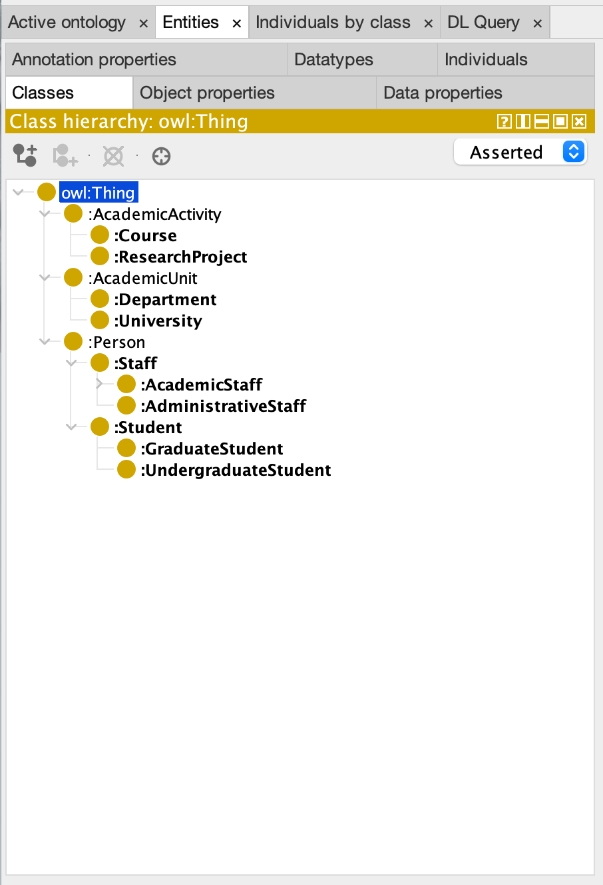
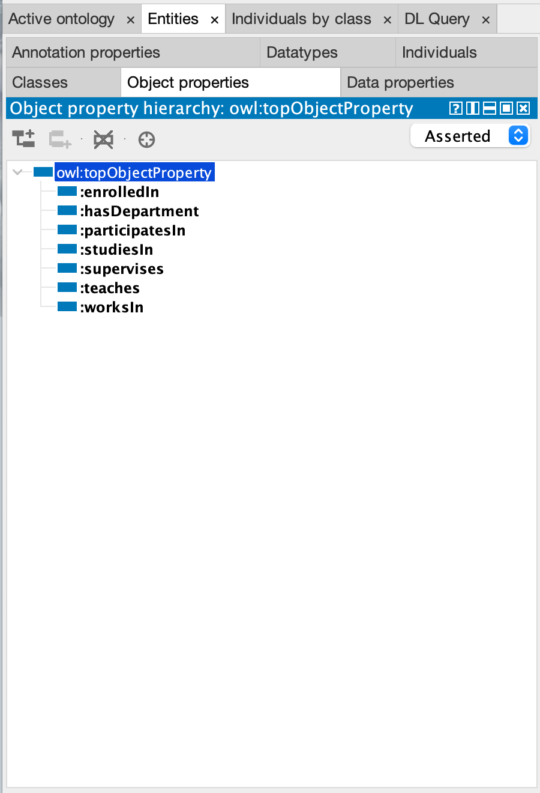
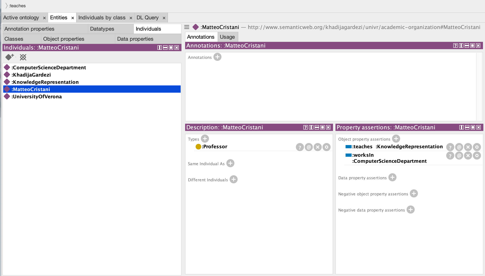
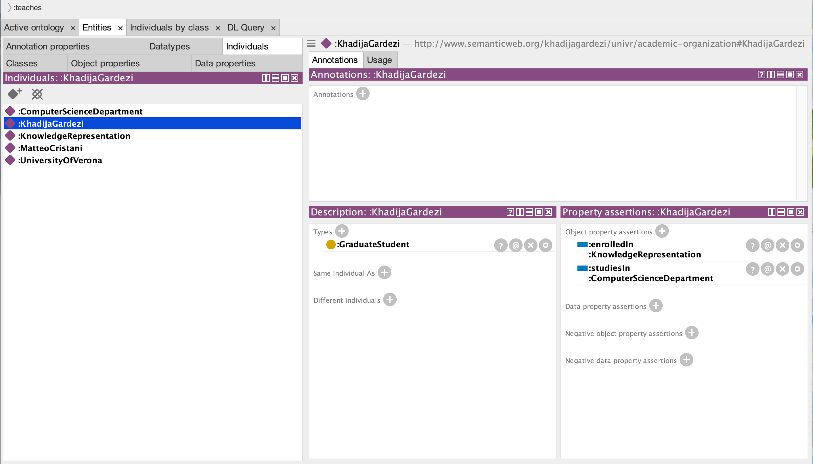
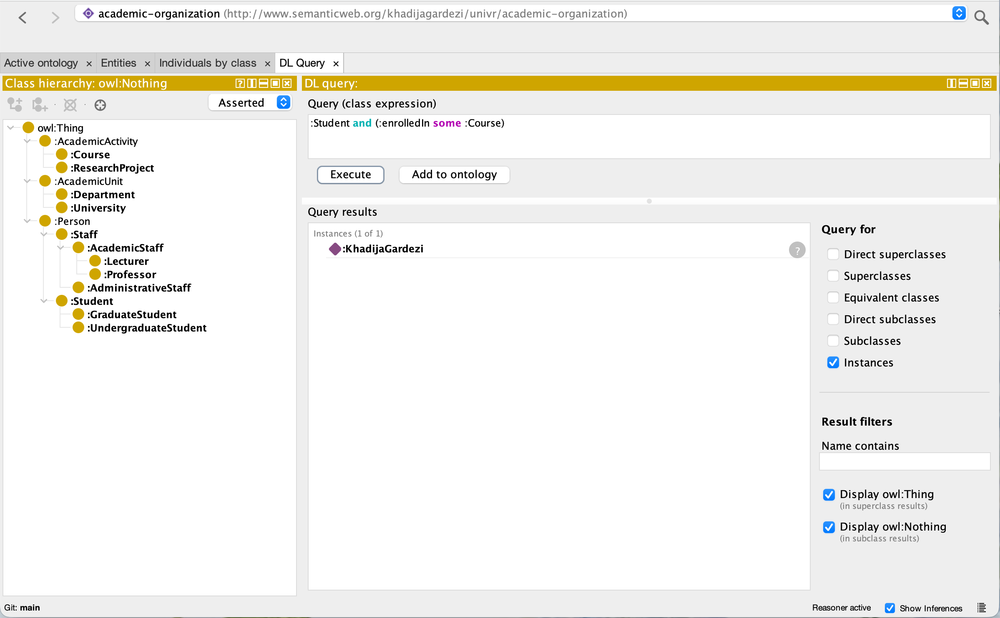

# Academic Organization Ontology

An OWL ontology that models the structure of an academic organization: universities, departments, people, courses, and research projects. It was built in [Protégé](https://protege.stanford.edu/) for the Knowledge Representation course at the University of Verona.

<p align="center"></p>

## Repository contents

| Path | Description |
| --- | --- |
| [`project.owl`](project.owl) | The ontology in RDF/XML format |
| [`docs/Academic Organization Ontology.pdf`](docs/Academic%20Organization%20Ontology.pdf) | Project report |
| [`images/`](images/) | Protégé screenshots used in this README |

## Ontology design

**Namespace:** `http://www.semanticweb.org/khadijagardezi/univr/academic-organization#`

### Class hierarchy

```
Person
├── Staff                      (disjoint with Student)
│   ├── AcademicStaff
│   │   ├── Professor          ⊑ ∃teaches.Course
│   │   └── Lecturer
│   └── AdministrativeStaff
└── Student
    ├── GraduateStudent        ⊑ ∃enrolledIn.Course
    └── UndergraduateStudent

AcademicUnit
├── University
└── Department

AcademicActivity
├── Course
└── ResearchProject
```

### Object properties

| Property | Domain | Range |
| --- | --- | --- |
| `enrolledIn` | Student | Course |
| `studiesIn` | Student | Department |
| `teaches` | AcademicStaff | Course |
| `supervises` | AcademicStaff | Student |
| `worksIn` | Staff | Department |
| `participatesIn` | Person | ResearchProject |
| `hasDepartment` | University | Department |

<p align="center"></p>

### Data properties

| Property | Domain | Type |
| --- | --- | --- |
| `hasName` | Person | `xsd:string` |
| `hasAge` | Person | `xsd:integer` |
| `studentID` | Student | `xsd:string` |
| `staffID` | Staff | `xsd:string` |
| `courseCode` | Course | `xsd:string` |
| `courseCredits` | Course | `xsd:integer` |

### Individuals

A small set of sample individuals shows how the ontology is used:

- **UniversityOfVerona** (`University`): `hasDepartment` ComputerScienceDepartment
- **ComputerScienceDepartment** (`Department`)
- **KnowledgeRepresentation** (`Course`)
- **MatteoCristani** (`Professor`): `teaches` KnowledgeRepresentation, `worksIn` ComputerScienceDepartment
- **KhadijaGardezi** (`GraduateStudent`): `enrolledIn` KnowledgeRepresentation, `studiesIn` ComputerScienceDepartment

<p align="center">
  
  
</p>

## Getting started

1. Install [Protégé](https://protege.stanford.edu/) (5.x or later).
2. Open `project.owl` via **File → Open**.
3. Start a reasoner (for example HermiT) from **Reasoner → Start reasoner** to check consistency and compute inferred classes.

## Example DL queries

With a reasoner running, open **Window → Tabs → DL Query** and try:

```
Student and enrolledIn some Course
```

```
AcademicStaff and teaches some Course
```

```
Person and worksIn value ComputerScienceDepartment
```

<p align="center"></p>

